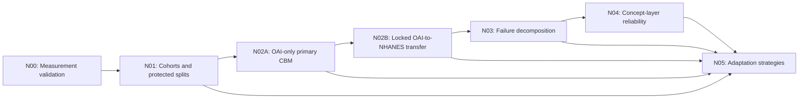

# Final Thesis Pipeline

This folder contains the seven notebooks that implement the final, auditable
analysis pipeline for cross-cohort knee osteoarthritis grading. The protocol is
a post-exploratory freeze, not a preregistration. Each stage has an explicit
input contract, writes an acceptance status, and prevents downstream analysis
when its required checks fail.

The notebooks are the pipeline specification. Generated tables, figures,
checkpoints, certificates, manifests, and logs are written to Google Drive at
`/content/drive/MyDrive/MasterThesis/Final Pipeline`, not to local runtime
storage.

## Execution Order

Run the notebooks in this order:



Do not bypass a failed status gate. A downstream notebook assumes that all
upstream cohorts, checkpoints, predictions, and manifests passed their
acceptance criteria.

## Notebook Catalogue

| Stage | Notebook | Role | Primary inputs | Key products |
| --- | --- | --- | --- | --- |
| N00 | `N00_Measurement_Validation.ipynb` | Validates the metrics and statistical procedures used throughout the pipeline using synthetic data only. | No patient data. | Shared `measurement_tools.py`, frozen measurement protocol, validation tables and figures, status, certificate, output manifest. |
| N01 | `N01_Cohorts_Labels_Protected_Splits.ipynb` | Reconstructs OAI and NHANES III cohorts, validates labels and concepts, and freezes patient-level splits. | Original OAI and NHANES source data; N00 status. | Frozen cohort files, source registry, label and concept tables, discovery/confirmation manifests, cohort figures, status, certificate. |
| N02A | `N02A_OAI_Only_Primary_CBM.ipynb` | Develops and freezes a three-seed ConvNeXt-Tiny concept-bottleneck ensemble using OAI only. | Frozen OAI cohort and split from N01. | Checkpoints, validation temperatures, OAI test predictions, model and checkpoint manifests, status, certificate. |
| N02B | `N02B_Transfer_Compile_Clean.ipynb` | Performs locked evaluation of the frozen OAI ensemble on OAI test and NHANES confirmation. | N02A checkpoints and temperatures; N01 cohorts. | OAI and NHANES predictions, transfer metrics, generalization-loss tables, bootstrap intervals, figures, status, certificate. |
| N03 | `N03_Failure_Decomposition.ipynb` | Separates image-to-concept perception failure from concept-to-grade mapping failure. | N02B prediction tables; N01 cohort data. | Four-condition decomposition predictions, effect intervals, concept-grade analyses, scientific verdict, figures, status, certificate. |
| N04 | `N04_Concept_Layer_Reliability.ipynb` | Tests whether concept-layer uncertainty identifies grading errors better than maximum-softmax response. | N02B predictions; N03 status. | Reliability scores, risk-coverage curves, selected threshold and transfer tables, scientific verdict, figures, status, certificate. |
| N05 | `N05_Adaptation_Strategies.ipynb` | Compares the frozen baseline and five adaptation strategies on target performance, mechanism repair, and source retention. | Frozen model, cohorts, predictions, and diagnostics from N01 through N04. | Per-method metrics, concept recovery and reliability analyses, bootstrap intervals, trade-off tables, scientific verdict, status, certificate. |

## Data Protection and Evaluation Rules

- N02A is OAI-only. It must not access NHANES data while training or selecting
  the primary model.
- NHANES is split into Discovery and Confirmation at the participant level in
  N01. Discovery supports adaptation development; Confirmation is retained for
  final evaluation.
- N02B is evaluation-only. It loads the frozen N02A ensemble and does not
  train, select, or modify checkpoints.
- N03 separates failure mechanisms using only concepts shared across the two
  cohorts, rather than treating all concept labels as universally comparable.
- N04 compares reliability measures on the same frozen ensemble outputs; it
  does not perform inference, retraining, checkpoint selection, or
  recalibration.
- N05 reports adaptation as a trade-off among target performance, mechanism
  repair, and OAI source retention rather than a single accuracy number.

## Reproducibility and Audit Trail

Every stage records the information needed to audit its products:

- deterministic seeds and an environment record;
- participant-level, rather than image-level, bootstrap procedures;
- schema, leakage, and input-integrity checks;
- status JSON gates and acceptance certificates;
- output manifests with file paths and hashes;
- Google Drive-safe output handling and save audits.

## Environment and Outputs

Run the pipeline in a Google Colab environment with Google Drive mounted. N02A
and the training components of N05 require a GPU in paper mode. The source
cohort files, processed images, frozen checkpoints, and upstream Drive
artifacts must already exist at the locations checked by each notebook.

All generated artifacts belong under:

```text
/content/drive/MyDrive/MasterThesis/Final Pipeline/
```

This includes `src`, `tables`, `figures`, `results`, `logs`, `configs`,
`certificates`, and `manifests`, organized by notebook stage where applicable.

## Reading Guide

For a methodological reading, start with N00 and N01 to establish what is
measured and which patients are protected. Read N02A and N02B together to see
the separation between model development and locked external evaluation. N03
then explains the transfer gap, N04 evaluates whether that gap can be flagged
reliably, and N05 asks whether adaptation repairs the diagnosed mechanism
without sacrificing source performance.

The notebooks include reader-guide markdown blocks for this same route. These
blocks are presentation aids only; they do not alter model code, configuration,
data access, or analysis logic.

## Artifact Naming Note

N02A is the presented stage name for primary OAI-only model development. Some
of its frozen checkpoints, tables, and manifests retain an `N03` identifier
because they originate from the earlier executed checkpoint protocol. Treat
that identifier as an immutable provenance label, not as an additional pipeline
stage. Do not rename these artifacts after a run, because downstream integrity
checks refer to their recorded paths and hashes.