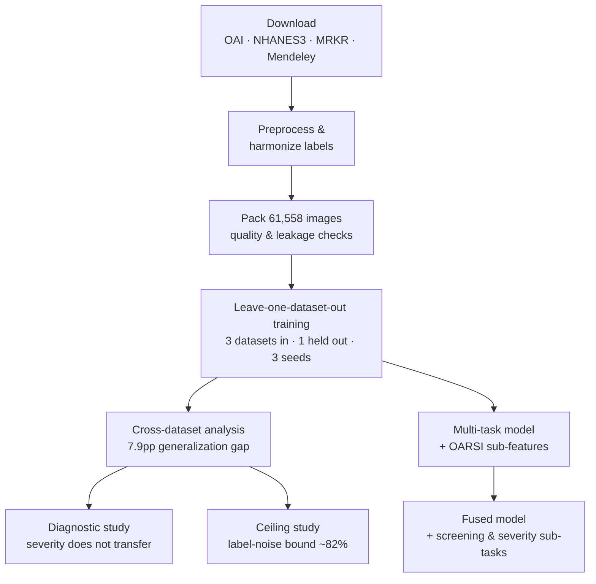

# Master-Thesis — Cross-Dataset Knee Osteoarthritis Grading

Master's thesis research (SRH Hochschule Heidelberg) on **cross-dataset
generalization** of deep learning models for **knee osteoarthritis (KOA)
severity grading** using the **Kellgren–Lawrence (KL)** scale.

## Goal

Train and evaluate KL-grade classifiers across multiple radiographic sources
(OAI, NHANES III, MRKR, Mendeley) and measure how well models generalize from
one cohort to another.

## Datasets

| Dataset | Role | Label type |
| --- | --- | --- |
| OAI | Primary train/eval source | Expert semi-quantitative (KXR_SQ) |
| NHANES III | Generalization source | KL grades |
| MRKR | Additional training source | Model-predicted (noisy pseudo-labels) |
| Mendeley | Supplementary source | KL grades |

> MRKR labels are pseudo-labels handled via **curriculum learning** that
> down-weights low-confidence samples early in training.

## Label validation (OAI)

| Check | Result |
| --- | --- |
| Exact agreement vs KXR_SQ_BU00 (16,014 knee-visit pairs) | 99.5% |
| Quadratic weighted kappa | 0.998 |
| JSW asymmetry cross-check (S4b) | 62% (below 80% threshold)* |

\*Reflects known KL-vs-JSW variability at early disease stages, not a labelling error.

## Pipeline

## Repository structure

| Path | Contents |
| --- | --- |
| `notebooks_standardized/pipeline_v1/` | End-to-end pipeline (`00`–`14`) |
| `notebooks_standardized/oai`, `nhanes3`, `mrkr`, `mendeley`, `oarsi`, `mt3` | Per-dataset download / preprocessing / modeling |
| `notebooks_standardized/calibration/` | Calibration & stability experiments |
| `notebooks_standardized/diagnostics/` | Cross-dataset diagnostic comparisons |
| `notebooks_standardized/experiments/` | Ablations and helper studies |
| `assessments/` | OAI radiographic assessment data + descriptors (see folder README) |
