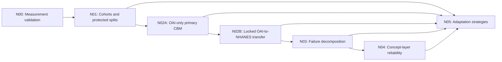

# Master Thesis: Audited Cross-Cohort Knee OA Grading

Master's thesis research at SRH Hochschule Heidelberg on the reliability of
deep-learning knee osteoarthritis (KOA) grading across radiographic cohorts.
The work uses the five-level Kellgren-Lawrence (KL) scale and asks not only
whether a model transfers, but why transfer fails and which failures can be
detected or repaired.

## Final Thesis Question

Can an OAI-trained concept-bottleneck model grade KOA reliably on an
independent NHANES III cohort, and can the resulting performance gap be
separated into image-to-concept perception failure, concept-to-grade mapping
failure, and detectable uncertainty?

The final analysis is a post-exploratory protocol freeze, not a
preregistration. It separates model development, locked transfer evaluation,
failure diagnosis, reliability analysis, and target-cohort adaptation.

## Final Pipeline

The canonical final workflow is documented in
[Final Notebook/README.md](Final%20Notebook/README.md).

```mermaid
flowchart LR
        N00[N00: Measurement validation] --> N01[N01: Cohorts and protected splits]
        N01 --> N02A[N02A: OAI-only primary CBM]
        N02A --> N02B[N02B: Locked OAI-to-NHANES transfer]
        N02B --> N03[N03: Failure decomposition]
        N03 --> N04[N04: Concept-layer reliability]
        N01 --> N05[N05: Adaptation strategies]
        N02A --> N05
        N02B --> N05
        N03 --> N05
        N04 --> N05
```

Key protections in the final pipeline:

- N02A develops the primary model using OAI only.
- N01 freezes participant-level NHANES Discovery and Confirmation subsets.
- N02B evaluates the frozen OAI ensemble without training or checkpoint
    selection on NHANES.
- N03 uses only genuinely shared radiographic concepts to distinguish
    perception from mapping failure.
- N04 compares uncertainty measures using the same frozen predictions.
- N05 reports target performance together with mechanism repair and OAI source
    retention, rather than optimizing a single metric.

## Data Sources and Evaluation Roles

| Dataset | Role in this repository | Labels and handling |
| --- | --- | --- |
| OAI | Primary source cohort for model development and internal evaluation. | Expert semi-quantitative readings, including KL and radiographic sub-features. |
| NHANES III | Independent target cohort for locked transfer evaluation and protected adaptation experiments. | KL grades with a participant-level Discovery/Confirmation split. |
| MRKR | Ancillary multi-source research cohort. | Model-predicted pseudo-labels, handled with reliability weighting and curriculum learning in the exploratory pipeline. |
| Mendeley | Provenance and preprocessing audit control. | Treated as an OAI-derived resource for audit purposes, not as independent external validation in the final pipeline. |

## Research Contributions

The repository contains two complementary bodies of work:

1. **Final auditable pipeline.** A seven-notebook OAI-to-NHANES analysis with
     validated measurement tools, protected cohorts, frozen checkpoints,
     participant-level bootstrap inference, acceptance gates, certificates, and
     artifact manifests.
2. **Exploratory and forensic studies.** Multi-source modeling, calibration,
     OARSI multi-task learning, and paired preprocessing/provenance experiments
     that test whether apparent cross-cohort shift can arise from data lineage or
     image-processing differences rather than population differences alone.

The provenance and preprocessing studies are described in
[research/novel/README.md](research/novel/README.md). They test preprocessing
variants on the same anatomy and frozen model, then repeat the comparison on
independent NHANES III images. The concept-bottleneck audit treats the
Mendeley/OAI relationship as a controlled opportunity to inspect
image-to-finding instability separately from clinical grading policy.

## Data Integrity

The processed OAI KL labels were validated against official
`KXR_SQ_BU00` records across 16,014 knee-visit pairs:

| Check | Result |
| --- | --- |
| Exact agreement | 99.5% |
| Quadratic weighted kappa | 0.998 |
| JSW asymmetry cross-check | 62% |

The lower JSW cross-check agreement reflects known KL-versus-joint-space-width
variability, particularly in early disease, rather than a mismatch with the
official OAI KL assessment.

## Repository Guide

| Location | Contents |
| --- | --- |
| [Final Notebook/](Final%20Notebook/) | Canonical final seven-stage thesis pipeline and its execution guide. |
| [research/](research/) | Exploratory, calibration, diagnostic, benchmark, and data-preparation notebooks. |
| [research/novel/](research/novel/) | Provenance, preprocessing-robustness, and concept-level transfer studies. |
| [research/pipeline_v1/](research/pipeline_v1/) | Earlier multi-source leave-one-dataset-out pipeline. |
| [assessments/](assessments/) | OAI radiographic assessment data and descriptors. |

## Documentation Map

- [Final Notebook/README.md](Final%20Notebook/README.md) is the authoritative
    execution guide for the final protected OAI-to-NHANES analysis.
- [research/README.md](research/README.md) indexes the earlier acquisition,
    multi-source, calibration, diagnostic, and benchmark studies.
- [research/novel/README.md](research/novel/README.md) documents the
    provenance, preprocessing, and concept-level forensic work.
- [assessments/README.md](assessments/README.md) describes the included OAI
    radiographic assessment source files.

## Reproducibility

The final notebooks are designed for Google Colab with Google Drive mounted.
They write tables, figures, checkpoints, certificates, logs, configurations,
and manifests to the Drive location specified in
[Final Notebook/README.md](Final%20Notebook/README.md). Do not bypass a failed
upstream status gate: downstream stages rely on the recorded cohort, checkpoint,
and prediction manifests.

This repository is for research and educational use. It is not a medical device
and is not intended for clinical decision-making.
