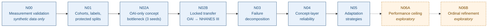

<div align="center">

# Generalizable Deep Learning for Knee Osteoarthritis Severity Grading

### A Multi-Dataset Approach

**Master's thesis · M.Sc. Applied Data Science and Analytics · SRH University Heidelberg · 2026**

[](#citation)
[](#quick-start)
[](#quick-start)
[](#quick-start)
[](#the-pipeline)
[](#license)

*Where does a knee X-ray grading model fail when it leaves its training cohort — in what it **sees**, or in how it **decides**?*

</div>

---

## In one paragraph

Deep-learning models that grade knee osteoarthritis on the Kellgren–Lawrence (KL) scale perform well on the cohort they were trained on and lose a great deal on radiographs from elsewhere. Most studies measure that loss; few say *where* it happens. This thesis trains a **concept-bottleneck model** on the Osteoarthritis Initiative (OAI) — an image encoder that first predicts the structural findings a radiologist looks for (osteophytes, sclerosis, joint space narrowing) and only then maps those findings to a KL grade — and evaluates it on **NHANES III**, an independently acquired, independently read population cohort. Because both cohorts carry human annotations for osteophytes and sclerosis, the two stages can be **swapped and tested separately** on the very same knees. The result: on this transfer the dominant failure is in the **perception stage** (recognising the findings), it is concentrated at **one clinically decisive boundary** (grade 2 osteophytes), concept-level uncertainty **detects** external errors better than output confidence does, and adaptation that targets the diagnosed stage **repairs** part of the failure without sacrificing source performance.

## Headline results

| Question | Finding | Evidence |
|---|---|---|
| How much is lost OAI → NHANES III? | QWK **0.7477 → 0.4188** (−0.3289, 95 % CI [−0.3780, −0.2757]) | `N02B` |
| Which stage fails? | Perception effect **0.5264** [0.4918, 0.5591] vs. mapping effect **0.0505** [0.0423, 0.0593] (QWK, human concepts) | `N03` |
| Where exactly? | Grade 2 osteophytes: **5.0 %** recall (7 / 140); 93.6 % over-called as grade 3 | `N03` |
| Can the errors be detected? | On NHANES III, concept entropy beats max-softmax (AURC 0.3878 vs 0.5556); within OAI the ordering reverses | `N04` |
| Can it be repaired? | Concept-guided adaptation: NHANES III QWK **0.4188 → 0.5499**, grade 2 recall **5.0 % → 42.1 %**, OAI QWK retained (0.7525) | `N05` |
| How high can a direct model go? | Exploratory ConvNeXt-Base: **0.7150** zero-shot on NHANES III (post-hoc, reported separately) | `N06A` |

All numbers above are read directly from the saved outputs of the notebooks named in the last column; every reported value in the thesis was cross-checked against them.

## The pipeline

The scientific analysis is a **locked, certificate-gated chain of notebooks**. Each stage validates its inputs, writes a status certificate, and the next stage refuses to run unless the previous certificate passed. `N00–N05` is a post-exploratory freeze (design fixed before the final runs, after earlier exploratory work); `N06A/N06B` are explicitly post-hoc extensions.


```mermaid
flowchart LR
    N00["N00<br/>Measurement validation<br/><i>synthetic data only</i>"] --> N01["N01<br/>Cohorts, labels,<br/>protected splits"]
    N01 --> N02A["N02A<br/>OAI-only concept<br/>bottleneck (3 seeds)"]
    N02A --> N02B["N02B<br/>Locked transfer<br/>OAI → NHANES III"]
    N02B --> N03["N03<br/>Failure<br/>decomposition"]
    N03 --> N04["N04<br/>Concept-layer<br/>reliability"]
    N04 --> N05["N05<br/>Adaptation<br/>strategies"]
    N05 -.-> N06A["N06A<br/>Performance ceiling<br/><i>exploratory</i>"]
    N06A -.-> N06B["N06B<br/>Ordinal refinement<br/><i>exploratory</i>"]
    classDef locked fill:#e8f1fb,stroke:#1f4e79,color:#1f4e79;
    classDef expl fill:#fff4e5,stroke:#b26a00,color:#7a4a00,stroke-dasharray: 4 3;
    class N00,N01,N02A,N02B,N03,N04,N05 locked;
    class N06A,N06B expl;
```

Full stage-by-stage contracts, data-protection rules and artifact naming are documented in [`Final Notebook/README.md`](Final%20Notebook/README.md).

## Repository map

```text
Master-Thesis/
├── Final Notebook/          The locked analysis pipeline (N00–N05) and the exploratory extension (N06A, N06B)
├── research/                Everything that came before: acquisition, multi-source experiments, diagnostics, provenance audits
│   ├── oai/                 OAI download, labels, preprocessing (the source cohort)
│   ├── nhanes3/             NHANES III download, labels, preprocessing (the target cohort)
│   ├── novel/               Provenance audit (Mendeley ≈ OAI), preprocessing-sensitivity and concept-policy studies
│   ├── pipeline_v1/         The original four-dataset leave-one-dataset-out study (historical)
│   ├── oarsi/  mt3/         OARSI sub-feature extraction and multi-task / cascade studies
│   ├── calibration/  diagnostics/  Evaluation/  experiments/  single_source/  SOTA/
│   ├── mendeley/  mrkr/     Acquisition of the two datasets later excluded from the final analysis
│   └── docs/                Written result reports
└── assessments/             OAI radiographic assessment files and their official documentation (read-only sources)
```

Every folder carries its own `README.md` explaining what the notebooks do, why, and how their status relates to the thesis narrative.

## Quick start

> The repository contains **code and documentation only**. No radiographs, labels or model weights are distributed here; they are governed by the data providers' terms (see [Data](#data-and-ethics)).

1. **Obtain the data.**
   - *OAI* — apply for access through the NIMH Data Archive (<https://nda.nih.gov/oai>) and accept the Data Use Agreement. The notebooks in [`research/oai/`](research/oai/) download the images and readings.
   - *NHANES III* — the knee radiographs and readings are public NCHS files; [`research/nhanes3/`](research/nhanes3/) downloads and processes them.
2. **Preprocess.** `oai_preprocess.ipynb` and `nhanes3_batch_process.ipynb` apply one identical chain to both cohorts: percentile intensity stretch → split of the bilateral film at the midline → left-knee mirroring → CLAHE → 224 × 224 PNG.
3. **Run the locked pipeline** in Google Colab with Google Drive mounted, in order, `N00 → N01 → N02A → N02B → N03 → N04 → N05`. GPU is required for `N02A`, `N05`, `N06A`, `N06B`. Artifacts are written under

   ```text
   /content/drive/MyDrive/MasterThesis/Final Pipeline/
   ```

4. **Optionally** run `N06A` and then `N06B`; `N06B` verifies the exact `N06A` locks and hashes before it will proceed.

Each notebook already contains its executed outputs, including the stage certificate and every summary table, so **all results can be inspected without re-execution**.

## Reproducibility and integrity

| Safeguard | What it does |
|---|---|
| Certificate gate | A stage runs only if the previous stage wrote a passing certificate |
| SHA-256 manifests | Every output is hashed and recorded with its path and generating notebook |
| Protected split | NHANES III is split at participant level into *Discovery* (adaptation) and *Confirmation* (reporting only) |
| Participant-level bootstrap | All confidence intervals resample participants, never knees |
| Frozen decision rules | Split seed 20260802; training seeds 367761876 / 1767922150 / 1023912954; backbone `convnext_tiny.fb_in1k`; AURC margin 0.01; AUROC margin 0.020; ensemble = equal-weight mean of three seeds |
| Measurement validation | The tie-safe AURC estimator and the bootstrap were validated on synthetic edge cases (`N00`) before touching patient data |

## Data and ethics

Data used in the preparation of this work were obtained from the Osteoarthritis Initiative (OAI) database. The OAI is a public-private partnership comprised of five contracts (N01-AR-2-2258; N01-AR-2-2259; N01-AR-2-2260; N01-AR-2-2261; N01-AR-2-2262) funded by the National Institutes of Health, a branch of the Department of Health and Human Services, and conducted by the OAI Study Investigators. Private funding partners include Merck Research Laboratories; Novartis Pharmaceuticals Corporation, GlaxoSmithKline; and Pfizer, Inc. This work was prepared using an OAI public-use data set and does not necessarily reflect the opinions or views of the OAI investigators, the NIH, or the private funding partners.

NHANES III data originate from the publicly released research files of the National Center for Health Statistics. This is a secondary analysis of previously collected, de-identified data; no new participant contact took place.

## Citation

```bibtex
@mastersthesis{hamrouni2026knee,
  author = {Hamrouni, Sami},
  title  = {Generalizable Deep Learning for Knee Osteoarthritis Severity Grading:
            A Multi-Dataset Approach},
  school = {SRH University Heidelberg, School of Information, Media and Design},
  year   = {2026},
  type   = {Master's thesis},
  note   = {Code: \url{https://github.com/SAMYSOSERIOUS/Master-Thesis}}
}
```

## Author and supervision

**Sami Hamrouni** — M.Sc. Applied Data Science and Analytics, SRH University Heidelberg  
Reviewers: **Prof. Dr.-Ing. Binh Vu** · **Prof. Dr.-Ing. Mehrdad Jalali**

Questions and issues are welcome via the [issue tracker](https://github.com/SAMYSOSERIOUS/Master-Thesis/issues).

## License

The code in this repository is released under the MIT License (see [`LICENSE`](LICENSE)). The OAI and NHANES III data are **not** part of this repository and remain subject to their providers' terms of use.
