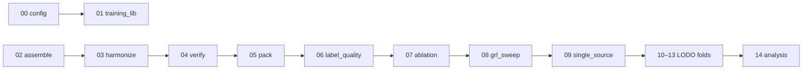

# pipeline_v1 — Primary Cross-Dataset Pipeline

The main end-to-end experiment for the thesis: a **leave-one-dataset-out (LODO)**
study of knee-osteoarthritis KL grading across OAI, NHANES III, MRKR and Mendeley.
Notebooks are numbered `00`–`14` and run in order — each stage produces an
artifact the next stage consumes.

## Scientific rationale

The central question is **generalization**: does a model trained on several
cohorts transfer to an unseen cohort? A single train/test split cannot answer
this, because train and test then share scanner, population and labelling
conventions. The LODO protocol removes one entire dataset from training and uses
it *only* for evaluation, so reported accuracy measures genuine out-of-domain
transfer rather than memorization of a cohort's idiosyncrasies.

## Notebooks

| # | Notebook | What it does | Why (method & justification) |
|---|----------|--------------|------------------------------|
| 00 | `00_config.ipynb` | Central parameter module (paths, LODO folds, model spec, MRKR subsampling, curriculum schedule). | One source of truth removes silent drift between notebooks and makes every run reproducible. |
| 01 | `01_training_lib.ipynb` | Defines the model and train/eval loop: **ConvNeXt-Large** backbone with stage-freezing + differential learning rates, a hierarchical KL head, and an auxiliary **domain classifier** via gradient reversal. | Transfer learning (freeze early stages) suits a small medical dataset; the domain head pushes the backbone toward dataset-invariant features. |
| 02 | `02_data_assembly.ipynb` | Merges per-dataset labels into one manifest; **stratified subsampling** of the model-predicted MRKR set. | A shared schema enables pooled training; capping MRKR prevents the largest (and noisiest) source from dominating the gradient. |
| 03 | `03_mendeley_harmonize.ipynb` | Re-normalizes the external Mendeley images (1–99 percentile stretch to 8-bit). | Removes photometric distribution shift so an external accuracy drop reflects *biology*, not brightness/contrast. |
| 04 | `04_verify.ipynb` | KL-scale consistency check + **subject-level leakage audit** (each subject forced into its majority split). | Leakage between train/val/test inflates accuracy; auditing it protects the validity of every downstream number. |
| 05 | `05_pack_images.ipynb` | Packs all 224×224 grayscale images into a single contiguous `uint8` array with an `arr_idx` index. | Converts tens of thousands of small file reads into one sequential transfer — large I/O speedup, no per-epoch latency. |
| 06 | `06_label_quality.ipynb` | **Confident-learning** reliability score for MRKR pseudo-labels (radiologist-trained model scores the probability of each given label). | Quantifies per-sample label trust so noisy labels can be down-weighted instead of discarded. |
| 07 | `07_ablation_runner.ipynb` | Cumulative ablation A→G (sampling, noise-aware loss, curriculum, domain-adversarial, 5-class vs ordinal/CORAL). | Isolates each component's marginal contribution — the controlled-experiment backbone of the thesis claims. |
| 08 | `08_grl_sweep.ipynb` | Sweeps the domain-adversarial weight (lambda) on the Mendeley fold. | Adversarial training is unstable in lambda; the sweep locates the accuracy/invariance trade-off empirically rather than by guesswork. |
| 09 | `09_single_source.ipynb` | Trains on each source alone, evaluates on Mendeley (RQ1). | Separates the effect of **source diversity** from the effect of the algorithm — the baseline the multi-source result must beat. |
| 10–13 | `10_fold1_mendeley` · `11_fold2_mrkr` · `12_fold3_nhanes3` · `13_fold4_oai` | The four LODO folds, each holding one dataset out, 3 seeds each. | Holding each dataset out in turn shows transfer is consistent, not an artifact of one lucky split; 3 seeds give a variance estimate. |
| 14 | `14_analysis_unified.ipynb` | Aggregation, confusion matrices, calibration, threshold optimization, **Grad-CAM**, and **bootstrap confidence intervals**. | Turns raw predictions into defensible findings: CIs convey uncertainty, Grad-CAM checks the model attends to the joint rather than artifacts. |

## Data flow

## Key methods at a glance

- **Architecture:** ConvNeXt-Large, stage-frozen, differential LRs.
- **Ordinal modelling:** KL is ordered (0<1<2<3<4) — CORN/CORAL respects that order instead of treating grades as unrelated classes.
- **Domain adaptation:** gradient-reversal domain classifier for cohort invariance.
- **Robustness to noisy labels:** confident-learning quality scores + curriculum weighting.
- **Evaluation:** leave-one-dataset-out, multi-seed, bootstrap CIs, calibration, Grad-CAM.
